# The Social-Engineer Toolkit (SET)

## Introduction

Selon la propre description donnée par [TrustedSec, LLC](https://www.trustedsec.com), la société de consulting américaine responsable du développement de ce produit, le [Social-Engineer Toolkit](https://github.com/trustedsec/social-engineer-toolkit/) est un framework de test d'intrusion open-source conçu pour l'ingénierie sociale. Le SET dispose d'un certain nombre de vecteurs d'attaque personnalisés qui vous permettent de réaliser rapidement une attaque crédible.

Le SET est spécifiquement conçu pour réaliser des attaques avancées contre l'élément humain. Il est rapidement devenu un outil standard dans l'arsenal des testeurs de pénétration. Les attaques intégrées dans la boîte à outils sont conçues pour être des attaques ciblées contre une personne ou une organisation utilisées lors d'un test de pénétration.


## Téléchargement et installation

Le SET est nativement supporté sur Linux et sur Mac OS X (experimental). Il est préinstallé sur Kali Linux et il est capable de se mettre à jour lui-même.

Pour une installation sur Ubuntu/Debian/Mac OS X :

```
git clone https://github.com/trustedsec/social-engineer-toolkit/ setoolkit/
cd setoolkit
pip3 install -r requirements.txt
python setup.py
```

## Que faut-il faire ?

Vous devez installer le Social Engineering Toolkit (SET), créer un collecteur d'identifiants (credential harvester), capturer certains identifiants utilisateur (les vôtres), créer une attaque de phishing, relier le collecteur d'identifiants à l'attaque. Pour chaque tâche, faites des captures d'écran de vos activités.

## Note sur l'éthique

Il n'est absolument pas acceptable d'attaquer quelqu'un pour quelque raison que ce soit. 

L'utilisation de cet outil à des fins autres que votre propre éducation et formation sans autorisation est strictement interdite par les politiques de ce cours et de l'école, ainsi que par les lois. 

Le but de cet exercice est de vous permettre de vous familiariser avec les outils et comment ils peuvent être utilisés dans le context professionnel d'un pentest. Ça vous permettra aussi de comprendre les tactiques de l'adversaire afin de pouvoir les contrer par le biais de la politique, de l'éducation et de la formation.

## Execution de SET

Pour executer SET, dans votre terminal tapper :

```
setoolkit
```

Dépendant de votre OS et de votre installation particulière, il est possible que certaines fonctionnalités ne soient pas disponibles au moins d'utiliser ```sudo```.

```
sudo setoolkit
```

# Exercice 1 - Credential Harvesting

Vous découvrirez l'un des outils les plus couramment utilisés par les ingénieurs sociaux et les acteurs malveillants pour tromper les cibles.

### Soumettre des captures d'écran

Pour le collecteur d'identifiants, montrez que vous avez cloné un site en indiquant son adresse web et l'interface d'utilisateur. Saisissez les informations d'identification sur votre clone local, puis cliquez le bouton de connexion. Essayez plusieurs sites comme facebook.com, twitter.com, et d'autres qui puissent vous intéresser. Faites des captures d'écran des mots de passe collectés dans vos tests avec SET.

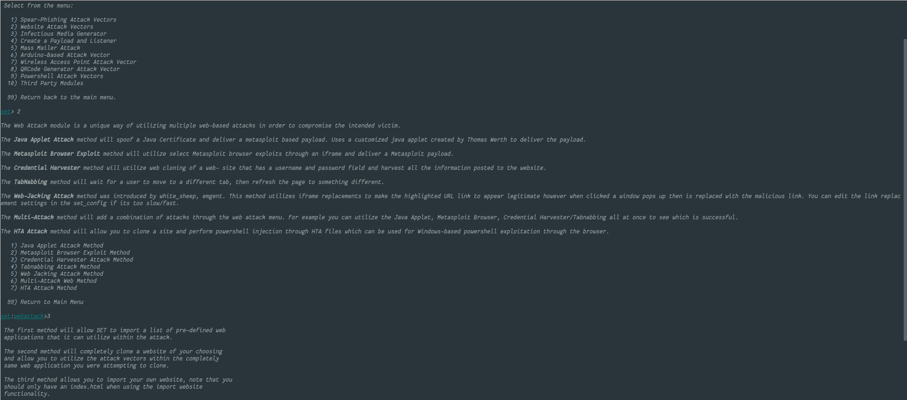

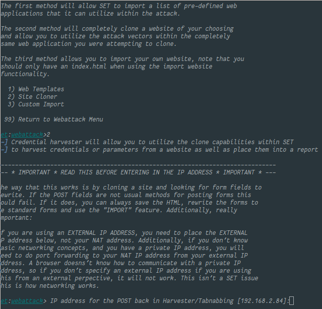

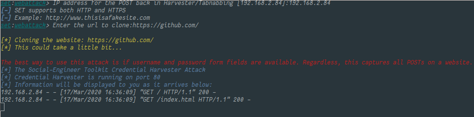

Vous pouvez voir sur les captures ci-dessus que j'ai pu faire le clone du site [github](github.com) avec le rendu visuel ci-dessous.


J'ai ensuite essayé de me connecter mais sans succès car une redirection de github me faisait partir du clone vers le site réel. C'est pour cela que j'ai ensuite essayé avec Twitter. Lors du login, le clone pense que j'ai entré des credentials mais à cause d'une redirection, les mauvais credentials sont reçus et le programme plante.

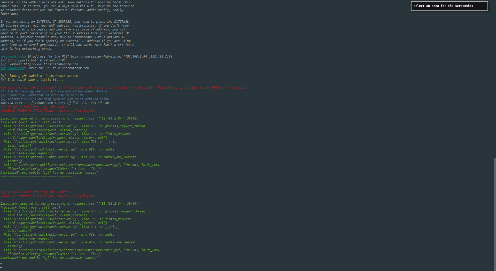

Suite à cela, j'ai refait la manipulation avec le site [Overleaf](overleaf.com) et cela a pu marcher sans soucis.

Bizarrement, le programme plante à la fin de l'exécution mais je n'ai pas pu trouver pourquoi à par le fait que j'utilise ma machine locale plutôt que la VM Kali.

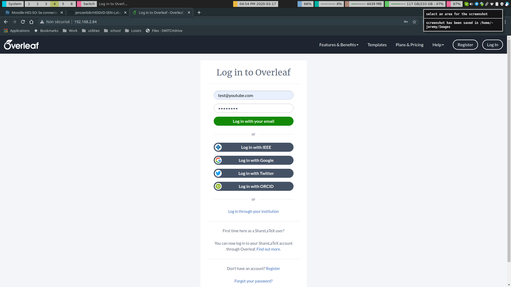

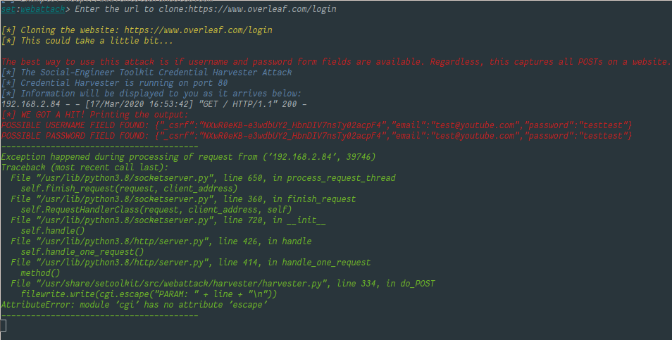

# Exercice 2 - Créer une attaque de phishing

Essayez la fonction d'attaque par phishing. C'est très facile à faire. Vous pouvez vous référer à ce lien pour plus d'informations http://www.computerweekly.com/tutorial/Social-Engineer-Toolkit-SET-tutorial-for-penetration-testers

Malgré les différents essais, je n'ai pas réussi à m'envoyer de mail...

Voici mes étapes et ce que j'ai fait : 

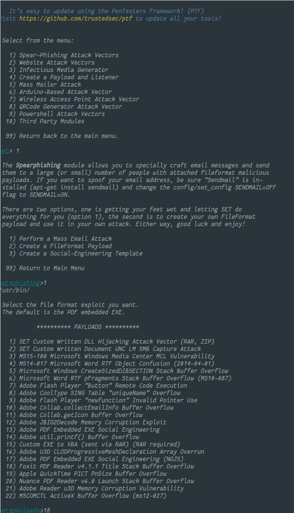

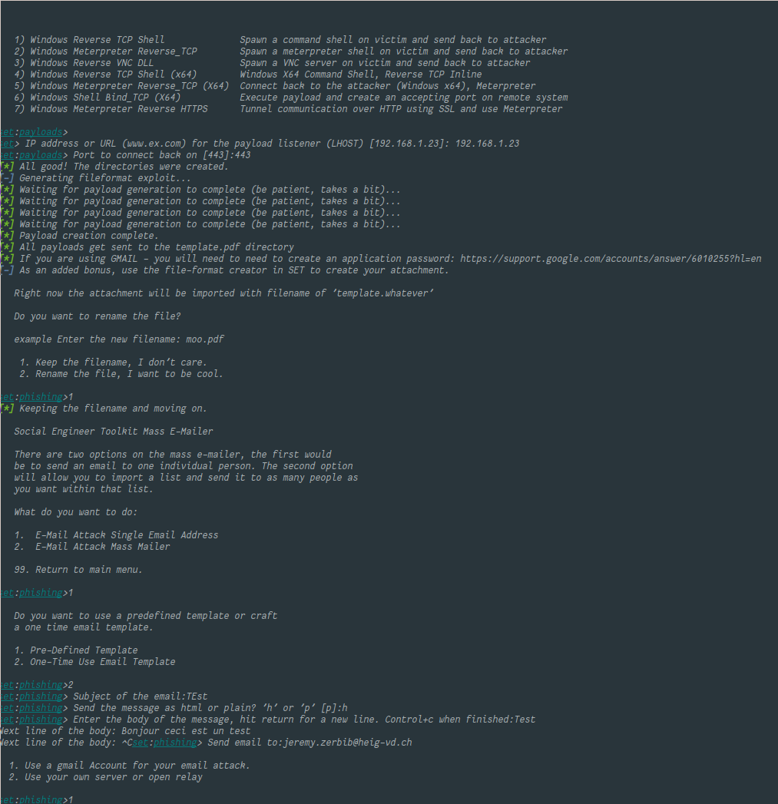

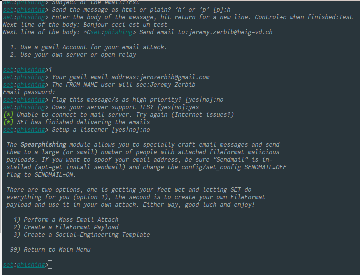

Au final, je n'ai pas trouvé pourquoi cela ne marche pas mais j'ai essayé avec le serveur de l'école sans succès aussi.


# Exercice 3 - Explorer les liens "Phishy" et le courrier électronique "Phishy"

Pour cette dernière partie de notre exploration du phishing, nous allons utiliser un contenu réalisé par les  Dr. Matthew L. Hale, le Dr. Robin Gandhi et la Dr. Briana B. Morrison de [Nebraska GenCyber](
http://www.nebraskagencyber.com). 

Visitez : https://mlhale.github.io/nebraska-gencyber-modules/phishing/README/ et passez en revue les modules 

- Analyse d'url (ce module peut être intéressant pour vos rapports de pentest, comme outil pour sensibiliser les employés d'une entreprise, mais il risque d'être trop simple pour vous)
- Analyse d'Email (me module est probablement plus intéressant techniquement pour vous)

En général, c'est un bon exemple de matériel de formation et d'éducation qui peut aider à lutter contre les attaques de phishing et à sensibiliser le personnel d'une organisation.

Vous avez la liberté de reproduire et d'utiliser le matériel grace à sa licence.


### Soumettre des captures d'écran

Pour cette tâche, prenez des captures d'écran de :

- Vos inspections de chaque lien dans votre navigateur
- Vos inspections d'un en-tête de courrier électronique à partir de votre propre boîte de réception

### Analyse des liens

Pour cette partie, j'ai pris les liens fournis par le site [suivant](https://robinagandhi.github.io/phishing-demo/phishing.html). 

#### Lien 1

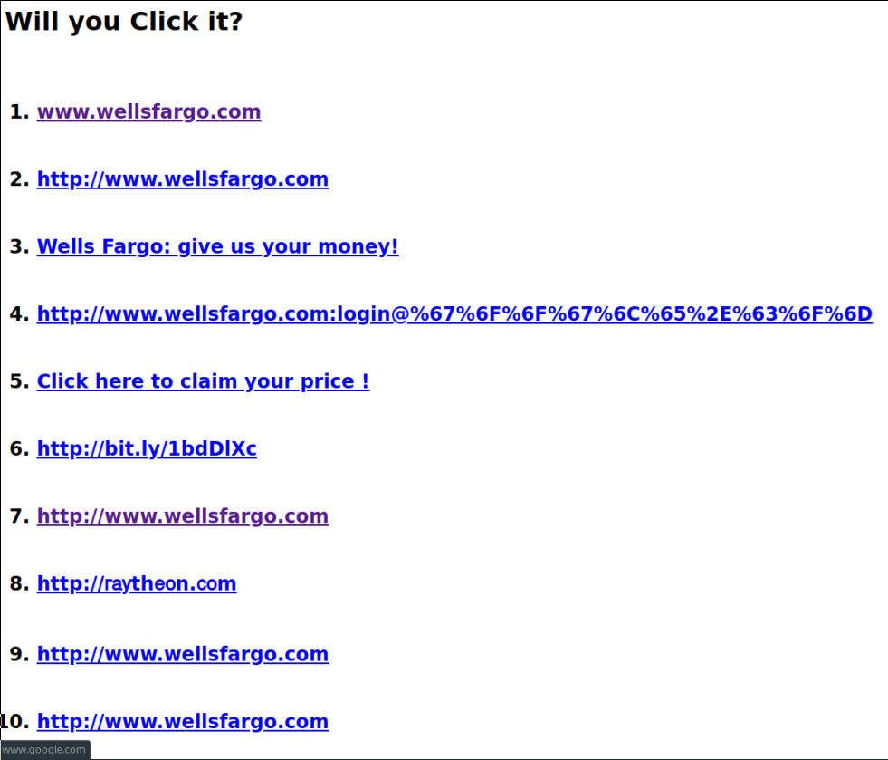

Nous pouvons donc voir que le lien affiché en bas à gauche de la fenêtre n'est pas celui affiché en première position.

Cela est dû au fait que dans le code HTML, la redirection se fait autre part : 

`<a href="http://www.google.com">www.wellsfargo.com </a>`

#### Lien 2

En analysant le code source de la page, en focus sur le lien, nous pouvons voir que le caractère `&shy` est omis par les navigateurs. Dans certains cas, Chrome par exemple, il est possible d'afficher ce caractère dans la barre en bas à gauche comme l'exemple ci-dessus.

`<a href="http://www.wells&amp;shyfargo.com">http://www.wells­fargo.com </a>`

#### Lien 3

Ce lien parait être OK.

#### Lien 4

En mettant notre curseur sur le lien, en bas à gauche, nous trouvons que nous sommes redirigés vers `google.com`. Nous pouvons essayer de trouver l'explication de ce comportement en regardant la valeur des caractères après le champ `login` de l'URL.

| Valeur hexadécimal | Valeur du caractère |
| ------------------ | ------------------- |
| %67                | g                   |
| %6F                | o                   |
| %6F                | o                   |
| %67                | g                   |
| %6C                | l                   |
| %65                | e                   |
| %2E                | .                   |
| %63                | c                   |
| %6F                | o                   |
| %6D                | m                   |

Vous pourrez trouver la correspondance des valeurs ASCII dans le tableau ci-dessous : 

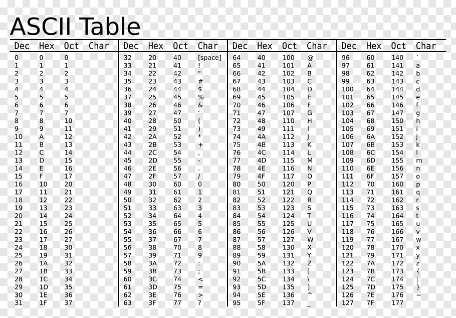

#### Lien 5

En inspectant le lien présenté, nous pouvons voir un lien compressé : 

`<a href="http://bit.ly/1bdDlXc">Click here to claim your price !</a>`

De ce fait, le réflexe à avoir est de décompresser ce lien avec un site spécialisé :  [http://checkshorturl.com/expand.php](http://checkshorturl.com/expand.php) par exemple. 

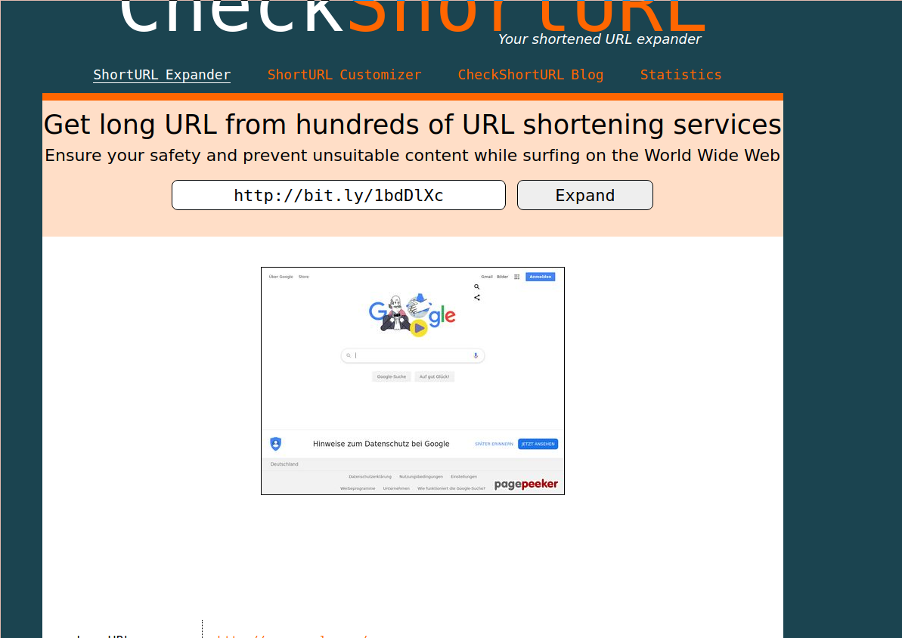

Nous pouvons voir que le lien redirige vers [Google](google.com)

#### Lien 6 

De prime abord, il semble que le lien affiché est le même que le lien 5. En passant la souris sur le lien, nous pouvons voir dans la barre en bas à gauche que le lien ne redirige pas vers la bonne URL. De ce fait, il faut repasser dans le code et on voit : 

`<a href="http://bit.ly/QZh8Fo">http://bit.ly/1bdDlXc</a>`

En passant le lien dans le site précédent, nous voyons que la redirection se fait vers [duckduckgo](duckduckgo.com). 

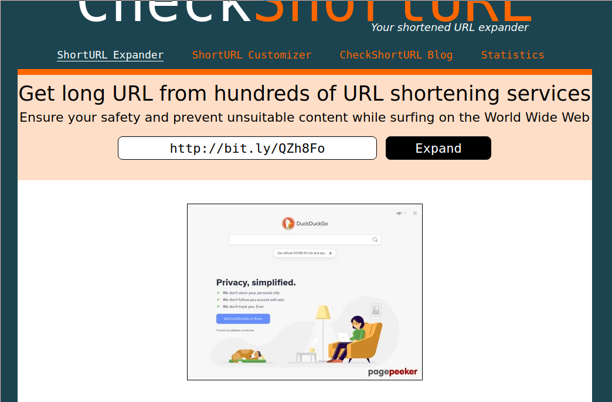

#### Lien 7

Dans le cas de lien numéro 7, l'attaquant a utilisé JavaScript pour forcer une redirection automatique quand le curseur passe sur le lien.

`<a href="http://www.google.com" onmouseover="window.location = 'http://www.google.com'">http://www.wellsfargo.com </a>`

#### Lien 8

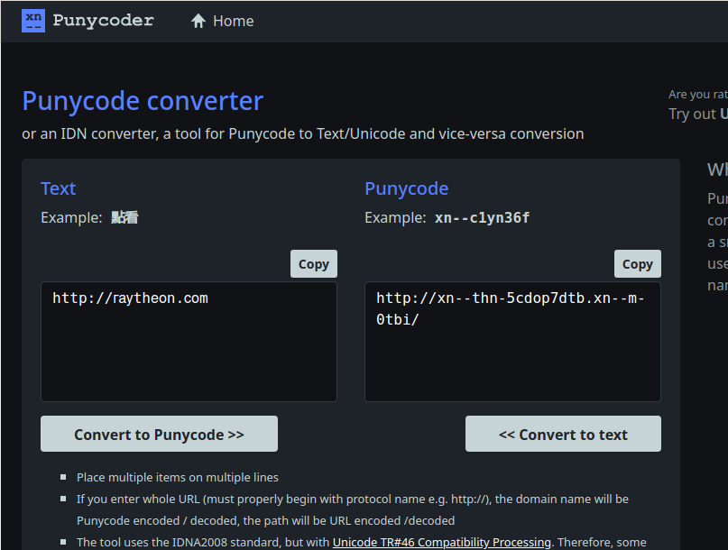

Dans le cas du lien fourni dans l'exemple, l'attaquant a utilisé des caractères codés en cyrillique mais qui graphiquement ressemble à des caractères latins. Même en regardant avec l'inspection de code, nous ne pouvons pas trouver d'indices de code malicieux. 

L'outil *Punycode* permet de coder des caractères internationaux pour les noms de domaine. 

#### Lien 9

Nous pouvons voir que si on ouvre le lien, la page est bien celle sur laquelle nous voulons aller. De prime abord tout du moins. En regardant de plus près l'URL, nous pouvons nous rendre compte qu'il y a quelque chose qui ne va pas. 

L'URL complète fait plusieurs pages donc je vais éviter de la copier ici mais en la passant dans décodeur d'URL, nous pouvons voir que le contenu entier d'une page forgée est encodé dans l'URL

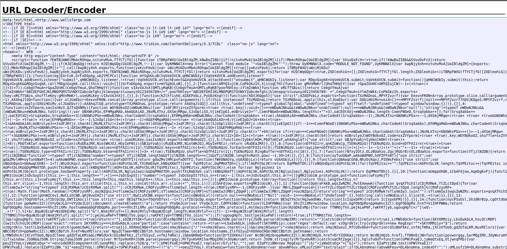

#### Lien 10

Même chose que le lien 9

#### Lien 11

`<a href="http://www.google.com" target="_blank" title="http://yahoo.com">Login <strong>HERE</strong></a>`

Le lien suivant provoque un comportement des plus troublants pour une proie "facile". En effet, un petit encadré montrera que le lien de redirection amènera sur [yahoo](yahoo.com) alors que la redirection se fait vers [google](google.com).

### Analyse d'en tête de mail

En allant dans mes spams, sur ma boîte mail personnelle, nous pouvons voir le *header* de mail suivant  :

```
Delivered-To: jerozerbib@gmail.com
Received: by 2002:ac2:5f57:0:0:0:0:0 with SMTP id 23csp302775lfz;
        Thu, 19 Mar 2020 19:30:49 -0700 (PDT)
X-Google-Smtp-Source: ADFU+vsEvyHDCStA5+yzq4fdtuhutXSpzIkDR37F8y+r0W27WEAU7IFTObe4VBI2jTQUtrwOVmVm
X-Received: by 2002:a1c:3585:: with SMTP id c127mr7090505wma.124.1584671449722;
        Thu, 19 Mar 2020 19:30:49 -0700 (PDT)
ARC-Seal: i=1; a=rsa-sha256; t=1584671449; cv=none;
        d=google.com; s=arc-20160816;
        b=wYNLnp4JFtP6YbPqHAA0yMiikUY4f9FgowtbhKhFrXonjEwBPE+uVeAik8nPSM7ste
         m/pdw8SgFA4t6WzkDy6hSupYcr+80qPDOOa1qnf4HNC8S3dvPCnWkSdxue+rGRz+Z/7f
         /8rT/IzQBXmHU3wEF1qL5Mo7m+AsG/SbP3Ec0cMfgQZVjdonjwwolLjbUIftMynzUvAt
         kbVtvNrB6xbCrEecOGGrWtn5LD/PR1qedi3BByLCCA+UE8qSON7gaCjLPSMMIhUZoACQ
         Be1fh1HKhB3xc9la3eHGp8J4AZxZdoghq/eg6KPzV32uCGj0DB8Xkrxr4lCx5TQhrJWt
         w5Ag==
ARC-Message-Signature: i=1; a=rsa-sha256; c=relaxed/relaxed; d=google.com; s=arc-20160816;
        h=mime-version:subject:to:from:date:message-id:message-id;
        bh=q029O6LrP1QcQqgTlUHcfUYJtWiR9SWcpORLejLx3F0=;
        b=PYPhCiOpsjxIiA6md+cAcxG70O23u5xJl4jsee32ACk62IDQxO53AEji5LgnrJSoRh
         epCMGWRlQ2fkBlBazfaCMW3/A7JmBSP6DZxSqTU7dohKOCw17e5SJ5ahsJjUY/Osl3bO
         ptdqthEh89tEVjph9ZMGsvvdORiCw4uAYuVMwhmLdwd94odX2KKG8G+wLzWRAlN12Xju
         7ABoMK3CGdOZeIVFtnIihP3CukwYnWVYTWXR6cjgCv3z2kW4z29Xk+RtB/8XMnFywcHo
         PX03RMH/tS4dlPkuhCtVrNuLC7f2lThv95RwwGPzSOD4hD0RBc/38mk7N/Nd1VZUpeIB
         G2Kg==
ARC-Authentication-Results: i=1; mx.google.com;
       spf=pass (google.com: best guess record for domain of return@ec2-90-510-510-510.us-west-2.compute.amazonaws.com designates 3.126.13.218 as permitted sender) smtp.mailfrom=return@ec2-90-510-510-510.us-west-2.compute.amazonaws.com
Return-Path: <return@ec2-90-510-510-510.us-west-2.compute.amazonaws.com>
Received: from a15-229.smtp-out.amazonses.com (ec2-3-126-13-218.eu-central-1.compute.amazonaws.com. [3.126.13.218])
        by mx.google.com with ESMTP id i11si4450576wra.298.2020.03.19.19.30.49
        for <jerozerbib@gmail.com>;
        Thu, 19 Mar 2020 19:30:49 -0700 (PDT)
Received-SPF: pass (google.com: best guess record for domain of return@ec2-90-510-510-510.us-west-2.compute.amazonaws.com designates 3.126.13.218 as permitted sender) client-ip=3.126.13.218;
Authentication-Results: mx.google.com;
       spf=pass (google.com: best guess record for domain of return@ec2-90-510-510-510.us-west-2.compute.amazonaws.com designates 3.126.13.218 as permitted sender) smtp.mailfrom=return@ec2-90-510-510-510.us-west-2.compute.amazonaws.com
Message-ID: <9lhcpHNA.129797.527.55353.4df0101c5ab08d6d55273a3c537e2227.ectomere.com@cisco.com>
Message-ID: <5e742ad9.1c69fb81.d62fd.7f6eSMTPIN_ADDED_BROKEN@mx.google.com>
X-Google-Original-Message-ID: <9lhcpHNA.129797.527.55353.4df0101c5ab08d6d55273a3c537e2227.javamail.tomcat@@ yelp.com>
Received: from smtp-sendgrid.yelpcorp.com (ec2-52-34-255-49.us-west-2.compute.amazonaws.com )
Date: Fri, 20 Mar 2020 02:25:51 +0100
From: Congratulations l <9lhcpHNA@gzjwvc7ycwyyyelp.com>
To: jerozerbib@gmail.com
Subject: Congratulations - You Have (1) Lowe's Reward Ready To Claim!
MIME-Version: 1.0
Content-Type: text/html; charset=utf-8
```

Le champ *From* permet de se faire une bonne idée si l'adresse d'envoi est légitime ou non. En effet, dans mon cas, `9lhcpHNA@gzjwvc7ycwyyyelp.com` transpire l'adresse complètement fausse pour faire du phishing.

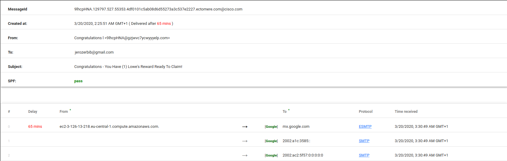

Au delà de cette partie, nous pouvons voir avec l'outil *GSuite Toolbox* que la SPF est valide mais le fait que le premier saut prenne 65 minutes pour se faire peut montrer un signe d'overload de serveur qui s'apparente à du mass mailing et donc du phishing. 